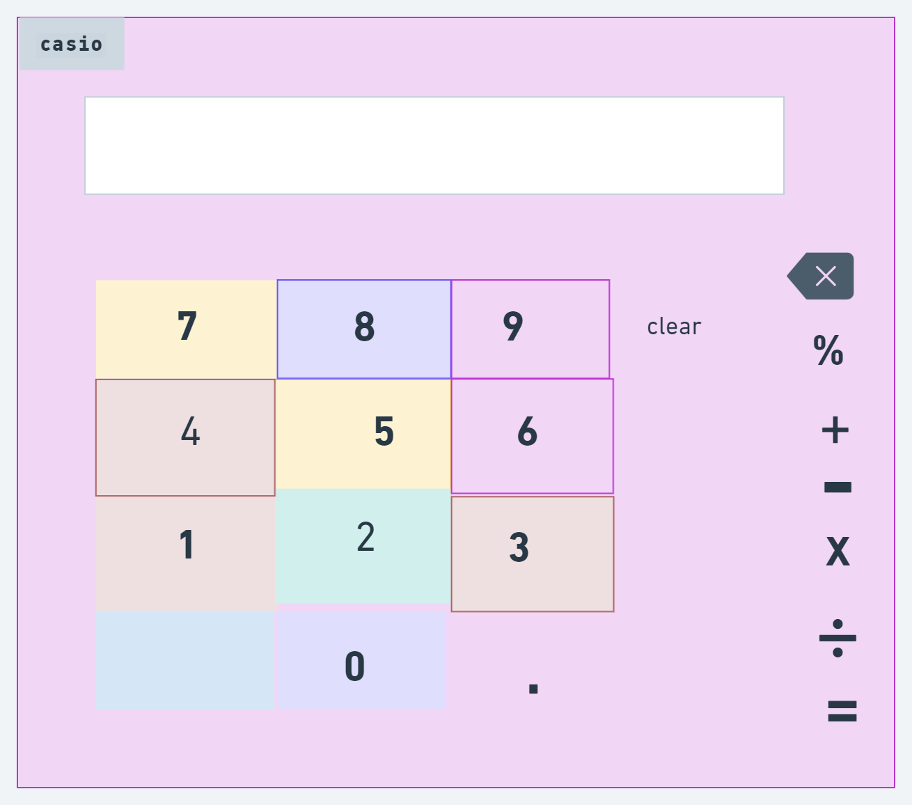
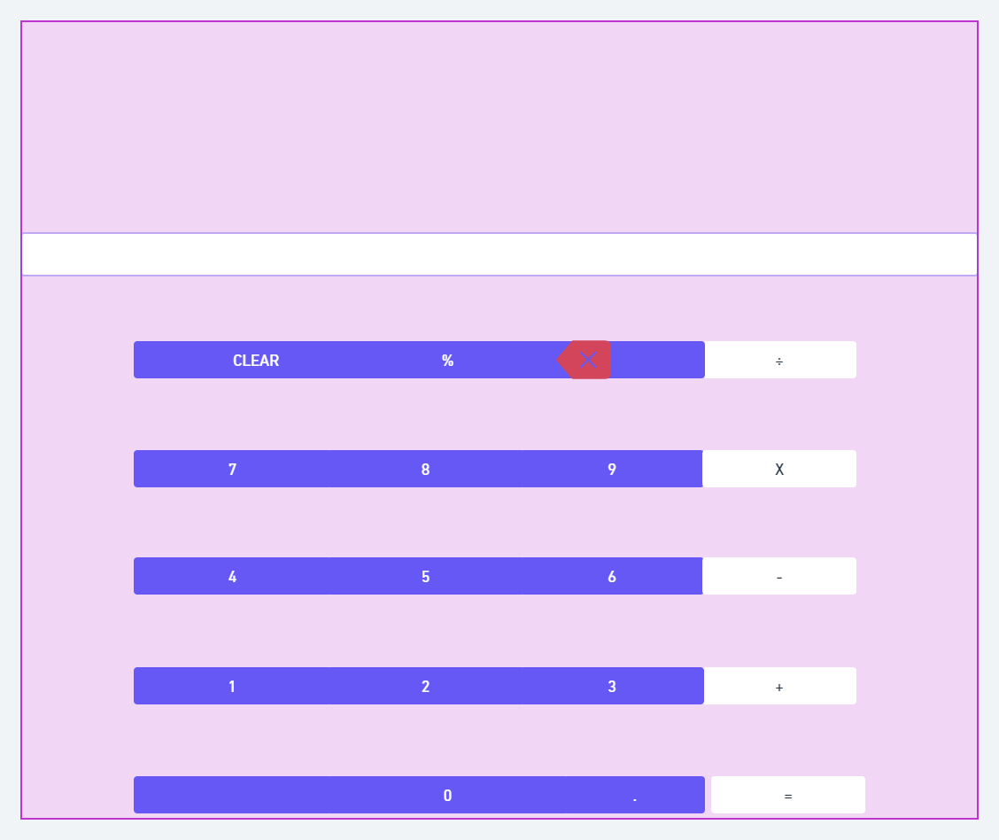

# calculator-project
I am building a calculator with class mates.

# MVP - *minimum viable product*
  
  - Functional
   - Add
   - Subtract
    - Multiply
    - Divide
    - Clear
    - sleek
    - simple
    - basic mathematics


# PMVP - *Post minimum Viable Product*

- do bills
- quickly
- 90s style
- Anima look
- Calculator interface pink
-  Keyboard function
-  Cool theme

# Wireframe *Figma*




####  I have chosen two step process and have chosen the better bold  Casio look alike

<!-- 
  # h1

  ## h2

  ### h3

  #### h4

  ##### h5 -->


<!-- **This is Bold Text**
*This is Italic Text*
>this is a block quote
- item 1
- item 2

1. item
2. item

`const dog = 'jake'`
``` const dog = 'jake'
___


  
  MIT License -->


# LICENSE


The above copyright notice and this permission notice shall be included in all
copies or substantial portions of the Software.
